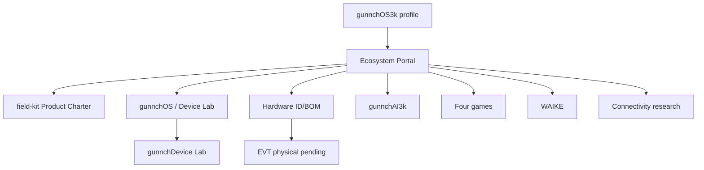

# Ecosystem map

Canonical navigation: this portal.  
Canonical charter: `gunnchos-7gc-ai-ran-field-kit/program/charter/`.  
`7gc-digital-twin` is research/twin — not the product spine ([history note](docs/history/PRIOR_SPINE_CLAIM.md)).
