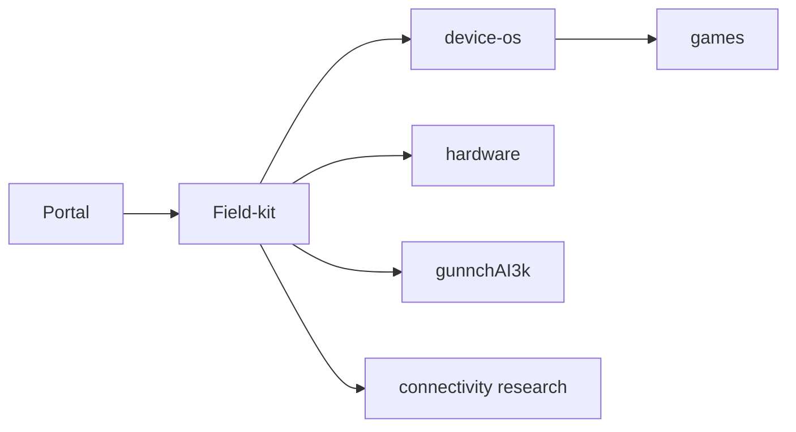

# Repository catalog

Canonical machine catalog also lives in field-kit `artifacts/wp012/REPO_CATALOG.yaml` (control plane). This portal mirrors it for navigation.

| Repo | Role |
|---|---|
| [gunnchos-7gc-ai-ran-field-kit](https://github.com/gunnchOS3k/gunnchos-7gc-ai-ran-field-kit) | Control plane / Product Charter |
| [gunnchos-research-portal](https://github.com/gunnchOS3k/gunnchos-research-portal) | This Ecosystem Portal |
| [gunnchOS3k](https://github.com/gunnchOS3k/gunnchOS3k) | Profile front door |
| [gunnchos-hardware-industrial-design](https://github.com/gunnchOS3k/gunnchos-hardware-industrial-design) | Hardware |
| [gunnchos-device-os](https://github.com/gunnchOS3k/gunnchos-device-os) | gunnchOS + Device Lab |
| [gunnchAI3k](https://github.com/gunnchOS3k/gunnchAI3k) | Local-first AI |
| [edge-io-measurement-node](https://github.com/gunnchOS3k/edge-io-measurement-node) | Edge measurement |
| [waike-research-ops](https://github.com/gunnchOS3k/waike-research-ops) | WAIKE |
| [anime-aggressors](https://github.com/gunnchOS3k/anime-aggressors) | Game |
| [pedestrian-pursuit](https://github.com/gunnchOS3k/pedestrian-pursuit) | Game |
| [archive-of-life-artifact-world](https://github.com/gunnchOS3k/archive-of-life-artifact-world) | Game |
| [beatlink-party](https://github.com/gunnchOS3k/beatlink-party) | Game |
| [ntn-resilience-sim](https://github.com/gunnchOS3k/ntn-resilience-sim) | NTN simulation |
| [spectrumx-ai-ran-gary](https://github.com/gunnchOS3k/spectrumx-ai-ran-gary) | AI-RAN research |
| [7gc-digital-twin](https://github.com/gunnchOS3k/7gc-digital-twin) | 7GC twin research |

