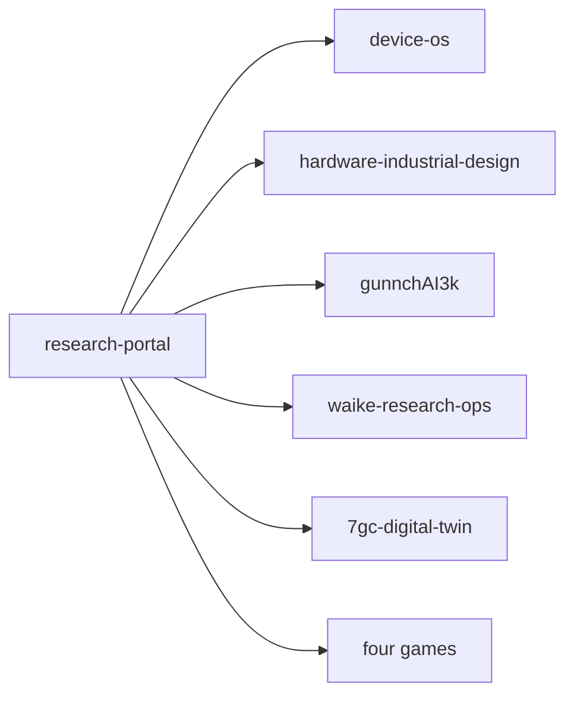

# Newcomer pack — gunnchos-research-portal

**One paragraph:** Canonical public entry for the gunnchOS3k experimental computing and communications portfolio: navigation, evidence maps, and honest claim boundaries — not a RAN, not hardware proof, and not a university appointment.

## Architecture



## Quick start

```bash
make bootstrap
make reproduce
make test
```

## Demo path

Open [START_HERE.md](../../START_HERE.md) (product) or [docs/phd/START_HERE_SUPERVISOR.md](../phd/START_HERE_SUPERVISOR.md) (faculty).

## Glossary / repo map / requirements

- Glossary: [GLOSSARY.md](../../GLOSSARY.md)
- Repo map: [REPO_CATALOG.md](../../REPO_CATALOG.md) · [ECOSYSTEM_MAP.md](../../ECOSYSTEM_MAP.md)
- Requirements / status: [STATUS.md](../../STATUS.md) · [EVIDENCE.md](../../EVIDENCE.md)

## Test commands

`make test` · `make audit` · `make reproduce`

## Known limitations / evidence status

Simulations ≠ RF. Device Lab ≠ EVT. Human playtest and physical prototypes remain pending where listed in STATUS/EVIDENCE.

## Support boundary

No production support SLA. Diagnostics/support engineering prep: [`../../artifacts/digital_engineering_exhaustion/stream_g/support/`](../../artifacts/digital_engineering_exhaustion/stream_g/support/). Issues: GitHub Issues on this repo.

## Policy files

CONTRIBUTING.md · SECURITY.md · LICENSE

Generated by Stream G 2026-09-18T18:33:52Z.
