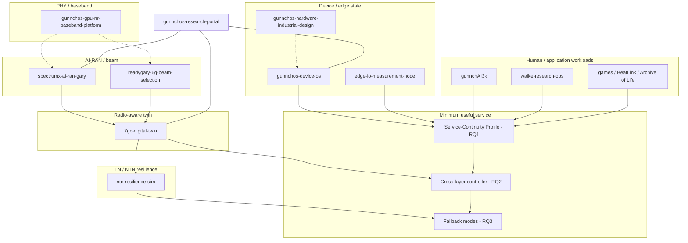

# Experimental system map

One doctoral control problem. Multiple experimental layers.

This diagram is the **ecosystem** view. It does not replace repository-specific UML under each repo’s `docs/uml/`.

## Layer contracts (interfaces, not undocumented assumptions)

| Interface | Producer | Consumer | Contract location (expected) |
|---|---|---|---|
| Hardware ↔ device OS | hardware-industrial-design | device-os | firmware/OS ICD in hardware repo |
| Device OS ↔ Edge I/O | edge-io-measurement-node | device-os | telemetry/consent schemas |
| Device OS ↔ gunnchAI | gunnchAI3k | device-os | capability-router / workload launch |
| Device OS ↔ WAIKE | waike-research-ops | device-os | learner activity packs |
| Device OS ↔ games | game repos | device-os | launcher contract |
| Edge I/O ↔ 7GC twin | edge-io | 7gc-digital-twin | measurement export / twin ingest |
| 7GC twin ↔ SpectrumX | 7gc-digital-twin | spectrumx-ai-ran-gary | twin-state JSON / manifests |
| 7GC twin ↔ NTN | 7gc-digital-twin | ntn-resilience-sim | scenario/failure families |
| ReadyGary ↔ RQ2 path | readygary | spectrumx / twin | beam metrics + latency class |

Versioned schemas should live with the producer. Compatibility tests belong in both producer and consumer CI when present.

## Flagship twin note

Gary, Indiana remains the **flagship scenario anchor**. Other 7GC names are **scenario environments**, not claims of community deployment.

## What this map is not

- Not a claim that all arrows are currently integration-tested end-to-end.  
- Not a claim of O-RAN/AODT/Sionna RT execution unless a repo’s current UML says so.  
- Not a replacement for SpectrumX’s judged-core vs extension vs future lanes.
