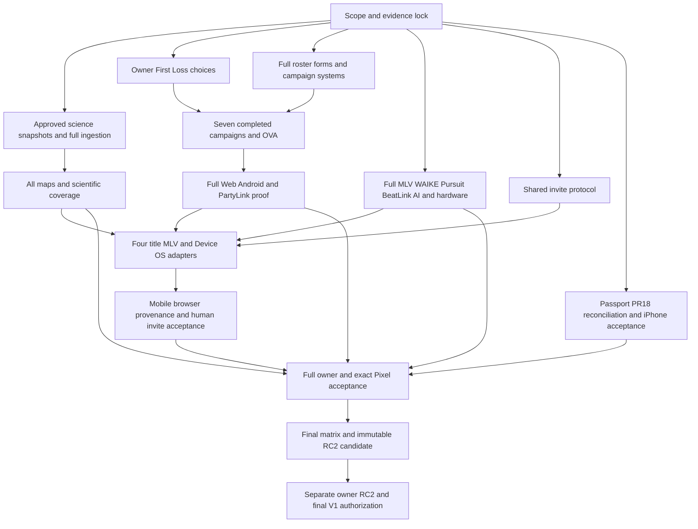

# V1.0.0 engineering execution — October 9, 2026

This is an implementation-ticket backlog committed for review, not GitHub issues dispatched to product teams. Exact bases are fixed below; before implementation, compare current remote main and preserve unique local changes. If a base has advanced, record the new SHA and evidence invalidations rather than silently changing the baseline. No force-push, merge, deploy or publication is authorized by this reconciliation.

## Critical dependency path

No task durations are evidenced; this is a dependency critical path, not a calculated longest-duration schedule. October 23 is conditional on completion, not an assurance. Archive external source acquisition and Anime canon/production work are the highest schedule risks. Start external/owner requests promptly while independent engineering proceeds.

1. REL-01 scope/evidence lock; retain every full-world, full-product, scientific and invite requirement. Website PR19 and MLV PR9 are already merged; do not repeat their old merge work.
2. ARC-01 approved source snapshots/licenses → ARC-02 full-source ingestion/UX → ARC-03 full maps/scientific audits. No sample-only substitute.
3. ANI-01 downstream technical campaigns + ANI-03 production roster/forms proceed; ANI-02 supplies six owner choices → full campaigns/ANI-04 OVA → ANI-05 exported platform/PartyLink proof.
4. MLV-01 full world → WAI-01 entire learner/assessment/offline/integration → MLV-02 hosted full matrix and WAI-02 academic review. PUR-01 complete all course/mode/item/Party Race paths and BL-01 rights-safe public party.
5. INV-01 shared protocol → four title adapters + MLV + Device OS adapters → INV-02 iOS/Android/browser/provenance matrix. Contract work can proceed before full title completion; acceptance joins complete title candidates.
6. PAS-01 reconcile existing #18 → PAS-02 future exact delivery + owner iPhone acceptance. DEV-01 full lifecycle/host/security; AI-01 evaluation; HW-01 full digital concepts and RES-* truthful evidence audit.
7. Complete product evidence → HUM-01 explicit full-scope owner approvals and PIX-01 exact non-destructive physical candidate acceptance. These cannot be closed by automation.
8. All required feature + automated + human + device + provenance gates → REL-02 complete final matrix/immutable RC2 candidate → REL-03 separate owner RC2 and final V1 authorization. Publication remains outside this task.

Suggested decision windows: October 9–10 lock scope and surface source/canon risks; October 11–17 implement full domain matrices; October 18–19 full owner/device acceptance; October 20 candidate freeze only if every gate is met; October 21–22 owner-controlled RC2/no-new-features final acceptance; October 23 owner-controlled final release. These are targets inherited/adapted from the completion plan, not completion forecasts. Missed gates move the release; they do not reduce scope.

## Repository implementation tickets

### REL-01 · P0 · Lock every required V1 feature and exact evidence identity

Repository: `gunnchOS3k/gunnchos-research-portal`. Base: `main` at `947138fcec929f7f21f1738fb6e2fad11f32661a`. Suggested new branch: `release/rel-01-v1`. Type: ENGINEERING.

Dependencies: none.

**Acceptance:** Validate this ledger against owner full-completion, Archive and invite overrides. Resolve any ambiguous scope with an explicit owner decision; retain all required rows until then. Record source SHA, artifact hash, deployment version, test scope/date and approval reference for each result.

### ARC-01 · P0 · Acquire and license full authoritative snapshot set

Repository: `gunnchOS3k/archive-of-life-artifact-world`. Base: `main` at `23ce4dafc2711449cab43a5bb6f42698c61ed2a1`. Suggested new branch: `release/arc-01-v1`. Type: EXTERNAL_AND_ENGINEERING.

Dependencies: REL-01.

**Acceptance:** Record full ICS chart and CoL releases, GBIF mapping/occurrences, PBDB extinct/fossil records and relevant Neotoma/IUCN datasets; evaluate Open Tree/EOL relationships/context with permitted fields. Record licenses, redistribution decisions, DOI/version/date/checksum, full denominators, failures and source age. External approvals are owner/source-provider gates. No scraping substitute or fixture denominators.

### ARC-02 · P0 · Ingest all pinned known-life and time records

Repository: `gunnchOS3k/archive-of-life-artifact-world`. Base: `main` at `23ce4dafc2711449cab43a5bb6f42698c61ed2a1`. Suggested new branch: `release/arc-02-v1`. Type: ENGINEERING.

Dependencies: ARC-01.

**Acceptance:** Reuse merged streaming/checkpoint/dedupe/synonym/conflict/index/offline engine; index every applicable eon/era/period/epoch/age and all accepted taxa in chosen full snapshots, synonyms and fossils. Prove restart/idempotency/incremental equivalence and numerator/full-source denominator with unresolved records. Complete taxonomic, extinct/extant, time, geography, lineage/provenance browse, progressive mobile search and game links.

### ARC-03 · P0 · Close full-Earth map and displayed-science gates

Repository: `gunnchOS3k/archive-of-life-artifact-world`. Base: `main` at `23ce4dafc2711449cab43a5bb6f42698c61ed2a1`. Suggested new branch: `release/arc-03-v1`. Type: ENGINEERING.

Dependencies: ARC-01, ARC-02.

**Acceptance:** Deliver all 17 supported Time Atlas gate maps, each covering 648 cells with packaged GeoJSON/PMTiles checksums, licensed non-mock approved source snapshots and uncertainty. Expand map requirements if full ICS support introduces gates. Replace mock hero science and NASA regional fallback with authentic licensed evidence or explicit unavailable states. Run typecheck, data, coverage, ArchiveDex, maps, implementation, release, source validation/audit, build, pipeline and audit:production. Qualified scientific review remains separate.

### ANI-01 · P0 · Complete seven campaigns, Gray and Convergence

Repository: `gunnchOS3k/anime-aggressors`. Base: `codex/anime-v1-closure-2026-10-06` at `e063b13bcb293ad3ac7b8673c82d8830f8e0b24d`. Suggested new branch: `release/ani-01-v1`. Type: ENGINEERING.

Dependencies: REL-01.

**Acceptance:** Continue preserved checkpoint: implement actual five-Puppet 3v2, release decisions/equilibrium 2v2/paired releases/Essence 2→4→6, second impossible confrontation, Gray gameplay/cinematics, endings/unlocks/next route and 5 Convergence nodes. Close all 145 nodes and 7/7 Gray routes through real encounter receipts and save/resume, never menu advancement. Parameterize unresolved First Loss identities; do independent downstream technical work without choosing owner canon.

### ANI-02 · P0 · Resolve six First Loss canon choices

Repository: `gunnchOS3k/anime-aggressors`. Base: `codex/anime-v1-closure-2026-10-06` at `e063b13bcb293ad3ac7b8673c82d8830f8e0b24d`. Suggested new branch: `release/ani-02-v1`. Type: OWNER.

Dependencies: REL-01.

**Acceptance:** Owner selects six unresolved First Loss identities/dialogue using checkpoint options; preserve Kaia→Rook. Approval must identify chosen canon and source/version; no automatic choice.

### ANI-03 · P0 · Finish full roster/forms/moves and authored presentation

Repository: `gunnchOS3k/anime-aggressors`. Base: `codex/anime-v1-closure-2026-10-06` at `e063b13bcb293ad3ac7b8673c82d8830f8e0b24d`. Suggested new branch: `release/ani-03-v1`. Type: ENGINEERING.

Dependencies: REL-01.

**Acceptance:** Complete nine fighters, 18 BASE male/female presentations and 64 declared form rows; validate all 216 move routes and 999 semantic slots in real runtime. Author bespoke locomotion/combat/aerial/throw/reaction/select/result/story acting and secondary hair/cloth motion, synchronized hitbox/VFX/SFX/camera. Distinct Yin/Yang inward absorption/outward creation kits and all non-base transform/combat/KO/results lifecycles. Candidate GLBs, 111 procedural slots and 135 WAVs cannot pass final art/motion/mix gates.

### ANI-04 · P1 · Finish full OVA and six Campaign Variations

Repository: `gunnchOS3k/anime-aggressors`. Base: `codex/anime-v1-closure-2026-10-06` at `e063b13bcb293ad3ac7b8673c82d8830f8e0b24d`. Suggested new branch: `release/ani-04-v1`. Type: ENGINEERING.

Dependencies: ANI-01, ANI-02, ANI-03.

**Acceptance:** Finish shared Story graph and route-specific chemistry/First Loss reactions, Prismatic focus/endings, expressive animation, screenplay, voice/music and cinematic mix. Watch pause/seek/return must not grant Story progress/unlocks. Continuous 131.6s preview is development evidence only.

### ANI-05 · P0 · Earn full exported Web/Android and PartyLink proof

Repository: `gunnchOS3k/anime-aggressors`. Base: `codex/anime-v1-closure-2026-10-06` at `e063b13bcb293ad3ac7b8673c82d8830f8e0b24d`. Suggested new branch: `release/ani-05-v1`. Type: ENGINEERING.

Dependencies: ANI-01, ANI-02, ANI-03, ANI-04.

**Acceptance:** Export exact implementation source, retain source SHA separate from evidence-only commit and artifact SHA256. Exercise full shipped campaigns and roster/form lifecycles on exported Web/Android; actual PartyLink declared 2/4/6/8 session matrix with no netcode overclaim. Recheck signer-safe Pixel path on this candidate; never reuse PR #118 device or old web CI as proof.

### MLV-01 · P0 · Complete the full world across seven campuses

Repository: `gunnchOS3k/3k-mlv`. Base: `main` at `2c14f13fcb049cb1ea71c9f4900c0abdbc37cd6d`. Suggested new branch: `release/mlv-01-v1`. Type: ENGINEERING.

Dependencies: REL-01.

**Acceptance:** PR #9 is merged, so continue main rather than resolving its old conflict. Preserve WorldRuntime. Complete Commons; My Home exterior/yard, living/front, media, office/workbench, bedroom/logoff; Gallery lobby/local culture/rotating institution/7GC exchange/public community/My Gallery; Transit; Gary/Ghana/Guyana/Geelong/Ruhr/Gaza/Graham Land. Every campus needs arrival, civic/lobby, lab, archive/gallery, showcase/community, return, local provenance and mobile/a11y/state evidence. House A/B/C design candidates and declared host adapters remain traceable. Reachability or Gary gold slice is insufficient.

### MLV-02 · P1 · Verify full hosted privacy, campus and creator matrix

Repository: `gunnchOS3k/3k-mlv`. Base: `main` at `2c14f13fcb049cb1ea71c9f4900c0abdbc37cd6d`. Suggested new branch: `release/mlv-02-v1`. Type: ENGINEERING.

Dependencies: MLV-01, WAI-01.

**Acceptance:** Bind deployed build to exact accepted source; test private/shared Home/Gallery creation, persistence/auth unavailable boundaries, seven Campus→WAIKE journeys, supported host shell/state/recovery/accessibility. Record full coverage and explicit human spatial/local-identity/usability review.

### WAI-01 · P0 · Close full learner/assessment/offline/integration matrix

Repository: `gunnchOS3k/gunnchos-waike-learning-platform`. Base: `main` at `2641042936f3b965daccb11091c80cbc6fa64f91`. Suggested new branch: `release/wai-01-v1`. Type: ENGINEERING.

Dependencies: REL-01.

**Acceptance:** Credit PR #27 and 18/18 compiled content. Verify every track authored lesson/assignment/quiz/lab/portfolio, supported Hub assessment lifecycle/groups/grades/receipts, offline install/restart/lease/revocation/conflict/retry/durable acknowledgement. Public no-Hub stays unavailable. Rebind standards supported subsets, gunnchAI real-or-unavailable and Device OS launch to final pins; production Hub and real AI remain distinct external claims, external certification remains outside software V1. Preserve 77 successful PR-head checks including native and real-Tauri evidence; rerun only changed final integration.

### WAI-02 · P1 · Close full 18-track academic and content review

Repository: `gunnchOS3k/waike-research-ops`. Base: `main` at `34ae043abbd38c89bd30f7ae1ae7cf8cc06645a0`. Suggested new branch: `release/wai-02-v1`. Type: OWNER_AND_ENGINEERING.

Dependencies: WAI-01.

**Acceptance:** Preserve V1 runtime content pin 63ba9f25ac6b8d8d1b6dd118923566fd51c57b62 separately from latest ops main. Review every package/outcome/rubric/AI policy, including IT Support absent policy declaration; document approvals and any remedial authored changes. Human learner/instructor/staff sessions across full declared product; no fake grades/approval.

### PUR-01 · P0 · Close complete courses/modes/items/Party Race matrix

Repository: `gunnchOS3k/pedestrian-pursuit`. Base: `main` at `957ff95b89d0516855ea61ddba19224a0583c3f8`. Suggested new branch: `release/pur-01-v1`. Type: ENGINEERING.

Dependencies: REL-01.

**Acceptance:** Credit merged #41 Not now/Race Now/tutorial reopening and rail/AI invariant fixes. PR #39 V4/power-up work is already merged (head c4f2f42b792307034e6e343c055c45c26e4ddf0d); do not repeat its merge or restart from the old candidate. Preserve any unique local continuation separately. Validate all eight launch courses, declared modes/items/shoes/boosts/shortcuts, race/countdown/checkpoints/laps/results/rematch/save, PartyLink/controller/Race Director, tutorial rewards and fresh-profile invite entry on exact exports. 768/768 AI and one lap are evidence, not full product completion.

Existing work to preserve/reconcile: https://github.com/gunnchOS3k/pedestrian-pursuit/pull/39

### BL-01 · P0 · Deliver usable rights-safe hosted party/session shell

Repository: `gunnchOS3k/beatlink-party`. Base: `main` at `e15bc30856c67c508ab0c56b401e05eb34a58595`. Suggested new branch: `release/bl-01-v1`. Type: ENGINEERING.

Dependencies: REL-01.

**Acceptance:** Reuse real Socket.IO lifecycle and five modes; prove create/join/ready/react/vote, scoring/calibration/results/rematch, reconnect/host migration/expiry/privacy with two real clients on exact candidate. Validate public join origin and current visual capture; persist sessions only if declared V1 requires it. Rights-safe content inventory and honest server/provider availability. A static Worker door or in-process load harness cannot pass hosted multi-client acceptance; expanded commercial rights are not required.

### PAS-01 · P1 · Reconcile Passport/Pass2U PR #18 onto taste-pass main

Repository: `gunnchOS3k/gunnchos-site`. Base: `main` at `3a46b0eb74eab7e41a4960fd5f6621c9d1c7170e`. Suggested new branch: `release/pas-01-v1`. Type: ENGINEERING.

Dependencies: REL-01.

**Acceptance:** Preserve source branch v1/passport-pass2u-event-final@3de66816db4be9f8261961cfe8b52659237c8f37, old PR base acd021361c4c3312dd49ebfbe29238f221b6434e. Reconcile onto current main preserving owner-approved taste/JPEG and Passport visual rules. Re-run 35 focused units/10 browser checks, privacy/QR decoding/print/share/focus, Cloudflare runtime and current CI. Produce local free Pass2U ZIP/front/background/logos/QR/fields/iPhone guide/Photos fallback for opted-in profile; no account, signing, payment or automatic publication.

Existing work to preserve/reconcile: https://github.com/gunnchOS3k/gunnchos-site/pull/18

### PAS-02 · P1 · Bind Passport delivery and physical owner acceptance

Repository: `gunnchOS3k/gunnchos-site`. Base: `main` at `3a46b0eb74eab7e41a4960fd5f6621c9d1c7170e`. Suggested new branch: `release/pas-02-v1`. Type: OWNER_AND_EXTERNAL.

Dependencies: PAS-01.

**Acceptance:** After separate future merge/deploy authorization, record exact main/version/hashes. Owner installs free Pass2U on iPhone and scans actual card, checks Photos fallback/share/privacy/event flow; V1_PASSPORT_HUMAN_PASS remains false until explicit approval. Official Apple/Google issuer signing remains external and is not a prerequisite for the authorized free Pass2U path.

### INV-01 · P0 · Implement shared HTTPS invitation/session protocol

Repository: `gunnchOS3k/gunnchos-site`. Base: `main` at `3a46b0eb74eab7e41a4960fd5f6621c9d1c7170e`. Suggested new branch: `release/inv-01-v1`. Type: ENGINEERING.

Dependencies: REL-01.

**Acceptance:** Recommended service host in existing site ecosystem, subject to architecture choice recorded in scope lock; no new domain attachment here. One https://play.gunnchos.com/i/<opaque-token> contract for Fight/Race/Party/Expedition; minimal safe identity/context references, version/expiry/state/max participants, signed or cryptographically opaque tokens, create/resolve/accept/decline/expired, tamper/version rejection, browser/uninstalled fallback. No private state/phone/contact/credential URL leakage; durable session semantics and idempotent acceptance. Do not build four independent token services.

### INV-ANI · P0 · Challenge to Fight

Repository: `gunnchOS3k/anime-aggressors`. Base: `codex/anime-v1-closure-2026-10-06` at `e063b13bcb293ad3ac7b8673c82d8830f8e0b24d`. Suggested new branch: `release/inv-ani-v1`. Type: ENGINEERING.

Dependencies: INV-01, ANI-03.

**Acceptance:** Create/share/accept/decline correct rules/fighter/stage/version challenge/lobby handoff; no claim of live cross-platform rollback.

### INV-PUR · P0 · Race Me

Repository: `gunnchOS3k/pedestrian-pursuit`. Base: `main` at `957ff95b89d0516855ea61ddba19224a0583c3f8`. Suggested new branch: `release/inv-pur-v1`. Type: ENGINEERING.

Dependencies: INV-01, PUR-01.

**Acceptance:** Track/rules/version/ghost reference/expiry; asynchronous ghost/time path where practical, results/rematch. Tutorial must not intercept accepted invite. No live racing claim.

### INV-BL · P0 · Join My Party

Repository: `gunnchOS3k/beatlink-party`. Base: `main` at `e15bc30856c67c508ab0c56b401e05eb34a58595`. Suggested new branch: `release/inv-bl-v1`. Type: ENGINEERING.

Dependencies: INV-01, BL-01.

**Acceptance:** Resolve into correct room/session shell; ready/react/vote where supported, safe unavailable-server state and permitted music boundary.

### INV-ARC · P0 · Join My Expedition

Repository: `gunnchOS3k/archive-of-life-artifact-world`. Base: `main` at `23ce4dafc2711449cab43a5bb6f42698c61ed2a1`. Suggested new branch: `release/inv-arc-v1`. Type: ENGINEERING.

Dependencies: INV-01, ARC-02.

**Acceptance:** Resolve time/taxon/region/expedition/collection/artifact/challenge references, retain scientific snapshot provenance; unavailable context is explicit. No synchronous multiplayer claim.

### INV-MLV · P0 · MLV invitation surface

Repository: `gunnchOS3k/3k-mlv`. Base: `main` at `2c14f13fcb049cb1ea71c9f4900c0abdbc37cd6d`. Suggested new branch: `release/inv-mlv-v1`. Type: ENGINEERING.

Dependencies: INV-01, MLV-01.

**Acceptance:** Visible Fight/Race/Party/Expedition create/open surface with correct routes and explicit unavailable friends/presence.

### INV-DEV · P0 · Device OS invite routing

Repository: `gunnchOS3k/gunnchos-device-os`. Base: `main` at `2ae070fd8b050c3520ed8dac211e0d607bf9f63f`. Suggested new branch: `release/inv-dev-v1`. Type: ENGINEERING.

Dependencies: INV-01, DEV-01.

**Acceptance:** Receive/open/route supported native or browser target safely; validate HTTPS universal/app-link configuration where packaging supports it and unsupported/uninstalled fallback. No invented notification backend.

### INV-02 · P0 · Earn cross-platform invite matrix and provenance

Repository: `gunnchOS3k/gunnchos-site`. Base: `main` at `3a46b0eb74eab7e41a4960fd5f6621c9d1c7170e`. Suggested new branch: `release/inv-02-v1`. Type: ENGINEERING.

Dependencies: INV-ANI, INV-PUR, INV-BL, INV-ARC, INV-MLV, INV-DEV.

**Acceptance:** Behavioral create/resolve/accept/decline/expire/tamper/version mismatch tests, all four title routes, MLV/Device OS, iOS/Android HTTPS and available native link bindings, browser fallback, privacy and truthful service state. Record exact build/source/deployed version for each adapter; all eight required invite automated tokens must pass before FULL_PASS. Human usability remains separate.

### DEV-01 · P0 · Close complete current-pin OS/Capsule/host lifecycle

Repository: `gunnchOS3k/gunnchos-device-os`. Base: `main` at `2ae070fd8b050c3520ed8dac211e0d607bf9f63f`. Suggested new branch: `release/dev-01-v1`. Type: ENGINEERING.

Dependencies: REL-01.

**Acceptance:** Verify Vault/App Center/browser/mail/Wallet/portfolio/verifier/Validation Center, app install/update/rollback/recovery/security and cross-app continuity on final product pins. Publish honest Windows/Linux/macOS/Android supported-host matrix; preserve prior digital passes as historical. Freeze exact APK/native/build hash/signing inventory without uninstall/data clear.

### AI-01 · P1 · Close supported student/instructor workflows and human eval

Repository: `gunnchOS3k/gunnchAI3k`. Base: `main` at `e08b68bdbc26715a903bca51a9740f621a3b2dd6`. Suggested new branch: `release/ai-01-v1`. Type: OWNER_AND_ENGINEERING.

Dependencies: REL-01.

**Acceptance:** Validate declared tutoring/assignment assistance/instructor flows, privacy, provider qualification and truthful unavailable fallback. Execute authentic human eval with source/model/provider IDs and record results. No autonomous AI or unqualified live-provider claim.

### HW-01 · P1 · Complete all four digital design concepts

Repository: `gunnchOS3k/gunnchos-hardware-industrial-design`. Base: `main` at `af5af66a28e36351b3929ef15756b6df6381ff6a`. Suggested new branch: `release/hw-01-v1`. Type: ENGINEERING.

Dependencies: REL-01.

**Acceptance:** Repair Student 14.5 disconnected fragment in source mesh; validate all Student 14.5/Handheld Hybrid/DS-XL/Rings design geometry, provenance/roles/controls and shell mappings. Digital review for every concept, export exact assets to public viewer. Physical EVT/DVT/PVT/certification/manufacturing remain out of official software V1.

### RES-01 · P1 · Audit every included research evidence contract

Repository: `gunnchOS3k/gunnchos-research-portal`. Base: `main` at `947138fcec929f7f21f1738fb6e2fad11f32661a`. Suggested new branch: `release/res-01-v1`. Type: ENGINEERING.

Dependencies: REL-01.

**Acceptance:** For all cataloged V1 projects, verify public source/reproduce/results/UML/citation links where available, pinned source/build and rights; missing artifacts explicitly unavailable. Include 7GC twin/field-kit/ReadyGary/SpectrumX/NTN/Edge IO/GPU NR/ESIP; no measured-topology/RF/carrier/live RIC claim. Source fixes belong in their repo on exact main from ledger.

### RES-TWIN · P1 · Bind research evidence and digital integration at final pin

Repository: `gunnchOS3k/7gc-digital-twin`. Base: `main` at `1a5491bf9261f77a75cc0fa7edbb5f25b425c7aa`. Suggested new branch: `release/res-twin-v1`. Type: ENGINEERING.

Dependencies: RES-01.

**Acceptance:** Run native documented reproduce/build/schema path for included V1 claims; preserve available architecture/results/citations and explicit missing/unmeasured labels. Record integration consumer pins and fix broken links in source repo, without synthetic-to-physical promotion.

### RES-FIELD · P1 · Bind research evidence and digital integration at final pin

Repository: `gunnchOS3k/gunnchos-7gc-ai-ran-field-kit`. Base: `main` at `9dfc326647880c244904dd50a47ea80c3d46748e`. Suggested new branch: `release/res-field-v1`. Type: ENGINEERING.

Dependencies: RES-01.

**Acceptance:** Run native documented reproduce/build/schema path for included V1 claims; preserve available architecture/results/citations and explicit missing/unmeasured labels. Record integration consumer pins and fix broken links in source repo, without synthetic-to-physical promotion.

### RES-BEAM · P1 · Bind research evidence and digital integration at final pin

Repository: `gunnchOS3k/readygary-6g-beam-selection`. Base: `main` at `e04b38b48cd2ebd87243153ca8fad9e914f16b21`. Suggested new branch: `release/res-beam-v1`. Type: ENGINEERING.

Dependencies: RES-01.

**Acceptance:** Run native documented reproduce/build/schema path for included V1 claims; preserve available architecture/results/citations and explicit missing/unmeasured labels. Record integration consumer pins and fix broken links in source repo, without synthetic-to-physical promotion.

### RES-RAN · P1 · Bind research evidence and digital integration at final pin

Repository: `gunnchOS3k/spectrumx-ai-ran-gary`. Base: `main` at `48eeacb7440af3a72966f3c4d5288d15c7de9617`. Suggested new branch: `release/res-ran-v1`. Type: ENGINEERING.

Dependencies: RES-01.

**Acceptance:** Run native documented reproduce/build/schema path for included V1 claims; preserve available architecture/results/citations and explicit missing/unmeasured labels. Record integration consumer pins and fix broken links in source repo, without synthetic-to-physical promotion.

### RES-NTN · P1 · Bind research evidence and digital integration at final pin

Repository: `gunnchOS3k/ntn-resilience-sim`. Base: `main` at `05aaa9aec16882f58bac6ce4ff47618d9812f69f`. Suggested new branch: `release/res-ntn-v1`. Type: ENGINEERING.

Dependencies: RES-01.

**Acceptance:** Run native documented reproduce/build/schema path for included V1 claims; preserve available architecture/results/citations and explicit missing/unmeasured labels. Record integration consumer pins and fix broken links in source repo, without synthetic-to-physical promotion.

### RES-EDGE · P1 · Bind research evidence and digital integration at final pin

Repository: `gunnchOS3k/edge-io-measurement-node`. Base: `main` at `f357b4c0fcfa77ea74d88e3263467dc60ec8cb2a`. Suggested new branch: `release/res-edge-v1`. Type: ENGINEERING.

Dependencies: RES-01.

**Acceptance:** Run native documented reproduce/build/schema path for included V1 claims; preserve available architecture/results/citations and explicit missing/unmeasured labels. Record integration consumer pins and fix broken links in source repo, without synthetic-to-physical promotion.

### RES-GPU · P1 · Bind research evidence and digital integration at final pin

Repository: `gunnchOS3k/gunnchos-gpu-nr-baseband-platform`. Base: `main` at `3931f51d43b7bee87db6d710a9df5a7c1136fcfa`. Suggested new branch: `release/res-gpu-v1`. Type: ENGINEERING.

Dependencies: RES-01.

**Acceptance:** Run native documented reproduce/build/schema path for included V1 claims; preserve available architecture/results/citations and explicit missing/unmeasured labels. Record integration consumer pins and fix broken links in source repo, without synthetic-to-physical promotion.

### RES-ESIP · P1 · Bind research evidence and digital integration at final pin

Repository: `gunnchOS3k/gunnchos-emergent-service-intent-protocols`. Base: `main` at `088c5e88e155aaf9e4711c7b87a85d37145bbe31`. Suggested new branch: `release/res-esip-v1`. Type: ENGINEERING.

Dependencies: RES-01.

**Acceptance:** Run native documented reproduce/build/schema path for included V1 claims; preserve available architecture/results/citations and explicit missing/unmeasured labels. Record integration consumer pins and fix broken links in source repo, without synthetic-to-physical promotion.

### HUM-01 · P0 · Record full-scope owner product acceptance

Repository: `gunnchOS3k/gunnchos-research-portal`. Base: `main` at `947138fcec929f7f21f1738fb6e2fad11f32661a`. Suggested new branch: `release/hum-01-v1`. Type: OWNER.

Dependencies: MLV-02, WAI-02, ANI-05, PUR-01, ARC-03, BL-01, AI-01, HW-01, PAS-02, INV-02.

**Acceptance:** Collect explicit build-bound owner approvals for all MLV regions, WAIKE full product/18-track academic review, Anime art/motion/feel/VFX/SFX/Story, all Pursuit courses/modes, Archive scientific/playability review, BeatLink rights-safe party, gunnchAI workflows, digital hardware, Passport and coherent four-title invites. Include accessibility review. Prior site approval is inherited only; no generated approvals or implied waivers.

### PIX-01 · P0 · Physically accept complete frozen Pixel candidate set

Repository: `gunnchOS3k/gunnchos-device-os`. Base: `main` at `2ae070fd8b050c3520ed8dac211e0d607bf9f63f`. Suggested new branch: `release/pix-01-v1`. Type: OWNER_AND_PHYSICAL.

Dependencies: ANI-05, PUR-01, ARC-03, BL-01, WAI-01, DEV-01, INV-02.

**Acceptance:** After full software candidates exist, install every declared exact candidate non-destructively; record accepted source/artifact SHA, package/signature, OS/device identifiers and full launch/handoff/core journeys. Resolve signer conflict only with explicit owner-approved safe path, never assume PR118 signer mismatch current. Owner physical acceptance is separate from responsive-browser tests.

### REL-02 · P0 · Run complete acceptance and freeze RC2 candidate

Repository: `gunnchOS3k/gunnchos-research-portal`. Base: `main` at `947138fcec929f7f21f1738fb6e2fad11f32661a`. Suggested new branch: `release/rel-02-v1`. Type: ENGINEERING.

Dependencies: HUM-01, PIX-01, RES-TWIN, RES-FIELD, RES-BEAM, RES-RAN, RES-NTN, RES-EDGE, RES-GPU, RES-ESIP.

**Acceptance:** Refresh all final accepted mains and deployed hashes after future approved merges; run entire declared cross-repo automated/security/a11y/privacy/rights/provenance/current-pin host and integration matrix, never carry a stale green to a new pin. Require every required feature and human/device gate, immutable manifest and rollback/reproduction links. Prepare RC2 only; publication/authorization are separate owner actions.

### REL-03 · P0 · Owner RC2 and final V1 authorization

Repository: `gunnchOS3k/gunnchos-research-portal`. Base: `main` at `947138fcec929f7f21f1738fb6e2fad11f32661a`. Suggested new branch: `release/rel-03-v1`. Type: OWNER.

Dependencies: REL-02.

**Acceptance:** Owner explicitly authorizes any RC2 publication after full candidate review; then no-new-features final acceptance and explicit v1.0.0 authorization. October 23 is a target, not permission or evidence. Do not publish or merge in this reconciliation.

### SITE-01 · P2 · Keep approved site and closed Open Lab boundary intact

Repository: `gunnchOS3k/gunnchos-site`. Base: `main` at `3a46b0eb74eab7e41a4960fd5f6621c9d1c7170e`. Suggested new branch: `release/site-01-v1`. Type: ENGINEERING.

Dependencies: REL-01.

**Acceptance:** Retain exact-main tasteful branding, canonical 278×252 JPEG exception, verified contact/SEO, public routes and closed upload/showcase flags while integrating Passport/invites. Search Console manual owner steps and higher-resolution transparent logo are tracked non-blocking improvements; no implied broad legal/K12/upload approval.

### PUB-01 · P2 · Track optional guidebook reader review

Repository: `gunnchOS3k/gunnchos-technology-landscape`. Base: `main` at `8d56d214fa6490ba6f99058babea834b5d3bb4ab`. Suggested new branch: `release/pub-01-v1`. Type: OWNER.

Dependencies: REL-01.

**Acceptance:** Preserve reader-preview and rights boundaries; human reader review remains open. Optional guidebook distribution does not become a core V1 blocker without an explicit owner scope decision.

