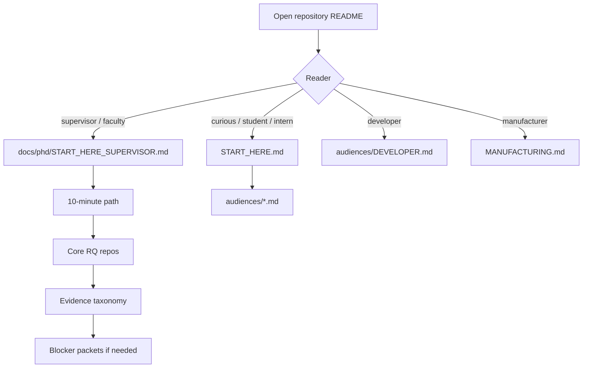

# Audience navigation activity — current

```mermaid
flowchart TD
  A[Open repository README] --> B{Reader}
  B -->|supervisor / faculty| C[docs/phd/START_HERE_SUPERVISOR.md]
  C --> D[10-minute path]
  D --> E[Core RQ repos]
  B -->|curious / student / intern| F[START_HERE.md]
  F --> G[audiences/*.md]
  B -->|developer| H[audiences/DEVELOPER.md]
  B -->|manufacturer| I[MANUFACTURING.md]
  E --> J[Evidence taxonomy]
  J --> K[Blocker packets if needed]
```

Sources: `README.md`, `START_HERE.md`, `docs/phd/SUPERVISOR_10_MINUTE_PATH.md`.
