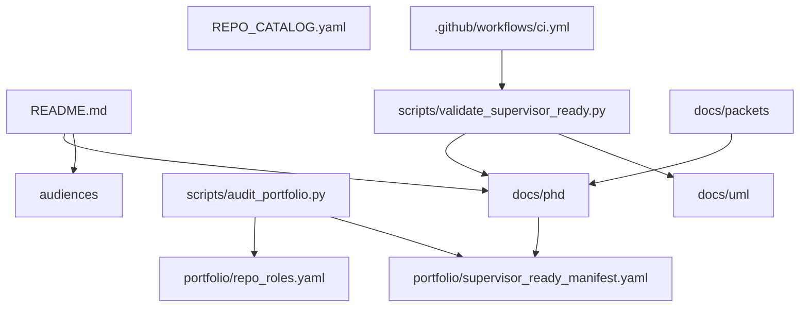

# Component — current

```mermaid
flowchart TB
  README[README.md]
  PHD[docs/phd]
  AUD[scripts/audit_portfolio.py]
  VAL[scripts/validate_supervisor_ready.py]
  ROLES[portfolio/repo_roles.yaml]
  MAN[portfolio/supervisor_ready_manifest.yaml]
  CAT[REPO_CATALOG.yaml]
  AUDENCE[audiences]
  PKT[docs/packets]
  UML[docs/uml]
  CI[.github/workflows/ci.yml]
  README --> PHD
  README --> AUDENCE
  PHD --> MAN
  AUD --> ROLES
  AUD --> MAN
  VAL --> PHD
  VAL --> UML
  CI --> VAL
  PKT --> PHD
```

There is no application server in this repo. `content/*.ts` is static catalog residue from the product portal cycle.
