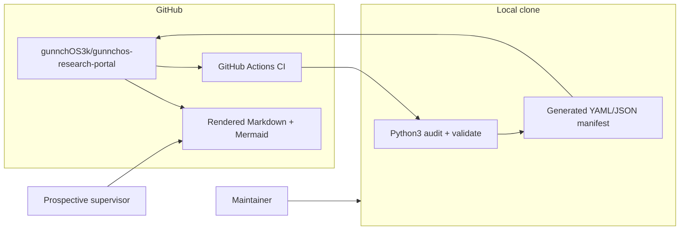

# Deployment — current

```mermaid
flowchart LR
  subgraph github [GitHub]
    REPO[gunnchOS3k/gunnchos-research-portal]
    GHA[GitHub Actions CI]
    MD[Rendered Markdown + Mermaid]
  end
  subgraph local [Local clone]
    PY[Python3 audit + validate]
    YML[Generated YAML/JSON manifest]
  end
  DEV[Maintainer] --> local
  PY --> YML
  YML --> REPO
  REPO --> MD
  REPO --> GHA
  GHA --> PY
  SUP[Prospective supervisor] --> MD
```

No production web host is claimed. GitHub is the deployment surface.
