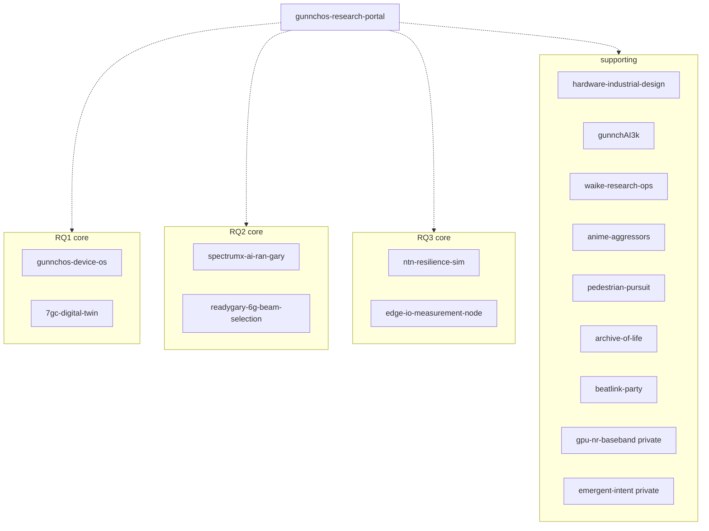

# Package / repository relationship — current

Sixteen in-scope GitHub repositories. This portal **navigates**; it does not vendor their code.

```mermaid
flowchart TB
  P[gunnchos-research-portal]
  subgraph rq1 [RQ1 core]
    OS[gunnchos-device-os]
    T7[7gc-digital-twin]
  end
  subgraph rq2 [RQ2 core]
    SX[spectrumx-ai-ran-gary]
    RG[readygary-6g-beam-selection]
  end
  subgraph rq3 [RQ3 core]
    NTN[ntn-resilience-sim]
    EIO[edge-io-measurement-node]
  end
  subgraph sup [supporting]
    HW[hardware-industrial-design]
    AI[gunnchAI3k]
    WK[waike-research-ops]
    G1[anime-aggressors]
    G2[pedestrian-pursuit]
    G3[archive-of-life]
    G4[beatlink-party]
    GPU[gpu-nr-baseband private]
    EM[emergent-intent private]
  end
  P -.-> rq1
  P -.-> rq2
  P -.-> rq3
  P -.-> sup
```

Roles: `portfolio/repo_roles.yaml`.
