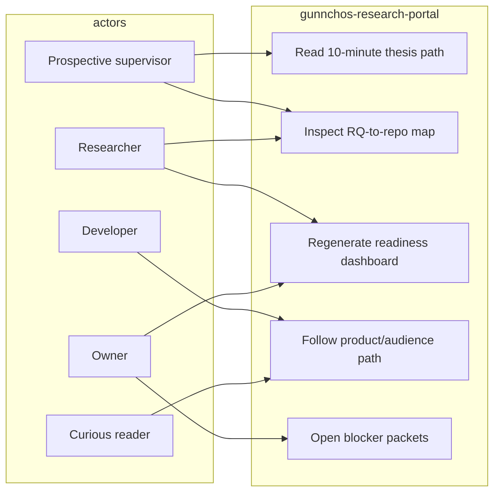

# Use case — current

Actors: prospective supervisor, researcher, developer, curious reader, Edmund (owner). This portal does not execute RAN control.

Code/docs: `docs/phd/*`, `audiences/*`, `scripts/audit_portfolio.py`.
